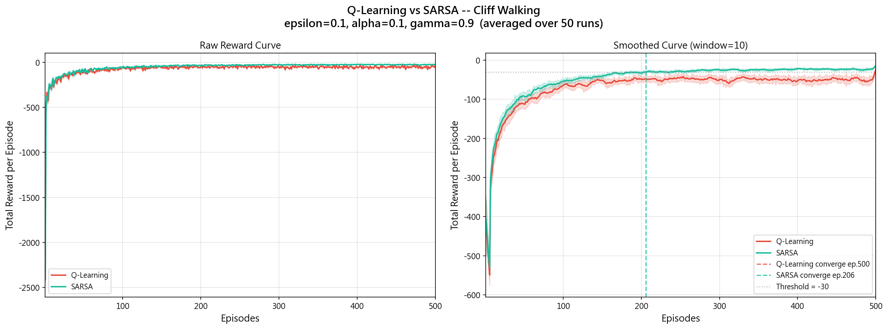
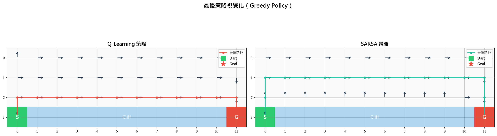
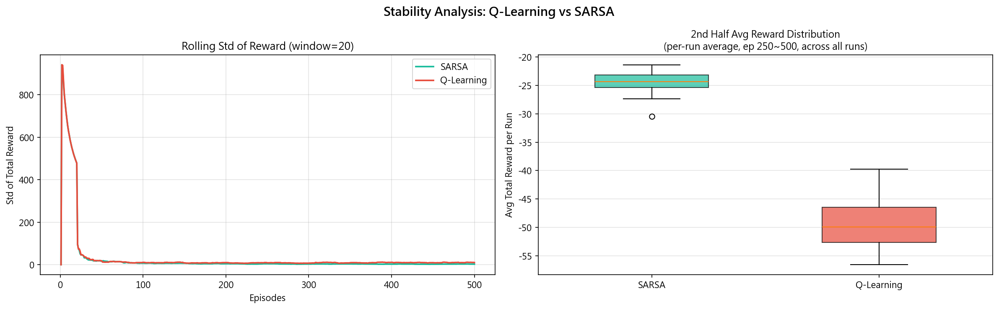
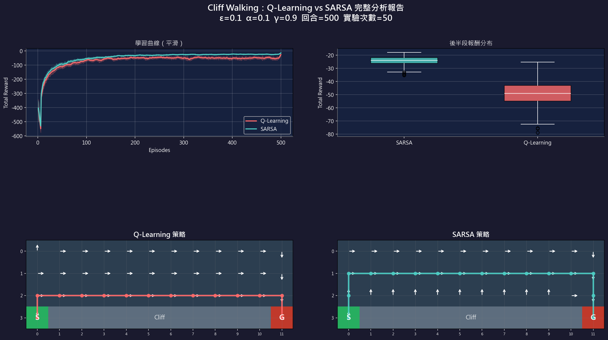

# Q-Learning vs SARSA：Cliff Walking 強化學習

> 比較 Q-learning（Off-policy）與 SARSA（On-policy）在 Cliff Walking 環境中的學習行為、收斂特性與最終策略差異。

---

## 環境設定

- **環境**：Cliff Walking（4 × 12 格子世界）  
- **起點**：左下角 `(3, 0)`  
- **終點**：右下角 `(3, 11)`  
- **懸崖**：底部 `(3, 1)` ～ `(3, 10)`，踏入獲得 −100 並回到起點  
- **每步獎勵**：−1  

## 超參數

| 參數 | 值 |
|------|----|
| 學習率 α | 0.1 |
| 折扣因子 γ | 0.9 |
| 探索率 ε | 0.1 |
| 訓練回合數 | 500 |
| 重複實驗次數 | 50 runs |

---

## 執行方式

```bash
pip install numpy matplotlib
python cliff_walking.py
```

執行後會自動生成以下 4 張圖表：

| 檔案 | 內容 |
|------|------|
| `learning_curves.png` | 每回合累積獎勵曲線（原始 + 平滑，含收斂標記） |
| `policy_visualization.png` | 最終學習策略箭頭圖 + 最優路徑 |
| `stability_analysis.png` | 滾動標準差 + 跨實驗報酬分布箱型圖 |
| `summary_dashboard.png` | 深色主題整合分析儀表板 |

---

## 演算法說明

### Q-Learning（Off-policy）

```
Q(s, a) ← Q(s, a) + α [ r + γ · max_a' Q(s', a') - Q(s, a) ]
```

更新基於「下一狀態的最佳可能行動」，不論實際執行何種動作。

### SARSA（On-policy）

```
Q(s, a) ← Q(s, a) + α [ r + γ · Q(s', a') - Q(s, a) ]
```

a' 由 ε-greedy 實際選出，更新直接反映探索策略的代價。

---

## 實驗結果

| 指標 | Q-Learning | SARSA |
|------|-----------|-------|
| 後半段平均報酬 | −49.32 | **−24.33** |
| 後半段報酬標準差 | 66.74 | **21.63** |
| 首次收斂回合 | ~500 | **~206** |
| 學習路徑風格 | 沿懸崖邊緣（最短） | 偏上方安全路徑 |

### 學習曲線


### 策略視覺化


### 穩定性分析


### 整合儀表板


---

## 結論

| 面向 | 結論 |
|------|------|
| **收斂速度** | SARSA 更快（約第 206 回合達 −30 門檻） |
| **訓練穩定性** | SARSA 標準差約為 Q-Learning 的 1/3 |
| **最終策略** | Q-Learning：懸崖邊最短路；SARSA：保守安全路徑 |
| **適用情境** | 學習期安全性優先 → SARSA；純貪婪部署 → Q-Learning |

---

## 參考資料

- Sutton, R. S., & Barto, A. G. (2018). *Reinforcement Learning: An Introduction* (2nd ed.). MIT Press. Chapter 6.
- Example 6.6: Cliff Walking
